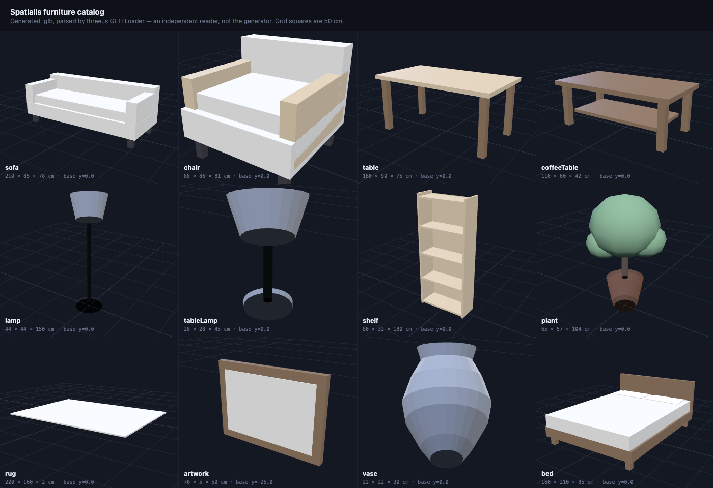

# Furniture assets

All twelve entries in `FURNITURE_CATALOG` have a model, so every catalog key is
reachable. Without these, `VoiceCommandController` answers *"No model loaded for
sofa"* for every spoken command and the Lens compiles but does nothing visible.



## What these are

Procedurally generated low-poly glTF, built by
[`Tools/generate_furniture.py`](Tools/generate_furniture.py). Generated rather
than downloaded for one reason: **the anchor engine depends on the pivot and the
scale being right**, and downloaded models arrive with arbitrary pivots at
arbitrary scale.

| Property | Value | Why it matters |
|---|---|---|
| Origin | At the base (`y=0` at the footprint) | `SurfaceAnchorEngine` puts an object's **origin** on the surface. A centre pivot sinks the piece halfway into the floor. |
| Size | Matches `FURNITURE_CATALOG` footprint/height, in cm | Overlap rejection and the "by the wall" offset use those same numbers. |
| Facing | +Z forward | Matches `yawTowards()`, so "face the user" actually does. |
| Materials | PBR factors only, no textures | Costs no texture memory, and gives `PBRMaterialSwapper` a clean `baseColorFactor` to override. |
| Budget | 1,786 triangles across all 12 | Trivial for Spectacles. |

The one deliberate exception: **`artwork` has its origin at its vertical centre**,
not its base, because it hangs on a wall rather than standing on a floor.

## ⚠️ Units — read this before importing

glTF 2.0 specifies metres. Lens Studio world space is centimetres. **Whether
Lens Studio converts on import is not confirmed in this repo**, so both variants
are provided:

```
Assets/Prefabs/*.glb        metres      (spec-correct: a 210cm sofa is 2.1 units)
Assets/Prefabs/cm/*.glb     centimetres (raw: a 210cm sofa is 210 units)
```

**Import one `sofa.glb` and read its size in the Inspector.** A sofa should be
about **210 units wide**, since Lens Studio world units are centimetres.

- Reads ~210 → keep that variant, delete the other.
- Reads ~2.1 → you imported the metres variant and Lens Studio did **not**
  convert. Use `Assets/Prefabs/cm/` instead.
- Reads ~21000 → you imported the centimetre variant and Lens Studio **did**
  convert. Use `Assets/Prefabs/` instead.

Getting this wrong is not subtle — furniture will be either invisible or the
size of a building — so one import settles it in under a minute.

## Regenerating

```bash
python3 Tools/generate_furniture.py --units m  --out Assets/Prefabs
python3 Tools/generate_furniture.py --units cm --out Assets/Prefabs/cm
python3 Tools/validate_glb.py --dir Assets/Prefabs --units m
```

`validate_glb.py` re-parses each `.glb` from raw bytes without reusing the
generator's code, then checks the container, the accessor bounds, the index
ranges, and — the checks that actually matter — each model's real-world
dimensions to 3% and that its origin sits where it should.

To eyeball the models, `Tools/preview_furniture.html` renders all twelve with
three.js (an independent glTF reader, not the generator):

```bash
npm run sim      # serves the repo on :8777
open http://localhost:8777/Tools/preview_furniture.html
```

## Wiring them up

In `VoiceCommandController`'s Inspector, `Furniture Keys` and `Furniture
Prefabs` are index-matched arrays. The key must match the catalog key exactly:

```
sofa  chair  table  coffeeTable  lamp  tableLamp
shelf  plant  rug  artwork  vase  bed
```

Note the camel case on `coffeeTable` and `tableLamp`. A mismatched key is not an
error — the piece simply never spawns, and the log says
`No prefab wired up for 'coffeetable'`.

See [SETUP_LENS_STUDIO.md](SETUP_LENS_STUDIO.md) for the full scene wiring.

## Replacing them

These are deliberately plain. If you swap in higher-fidelity models, preserve
the two invariants or the anchor engine misbehaves:

1. **Origin at the base**, centred on X/Z (except wall pieces).
2. **Real-world scale**, matching the `footprint` and `height` in
   `Scripts/SpatialisCore.ts` — or update the catalog to match the models.

Then re-run `validate_glb.py` against the new files; it will tell you if either
invariant broke.
