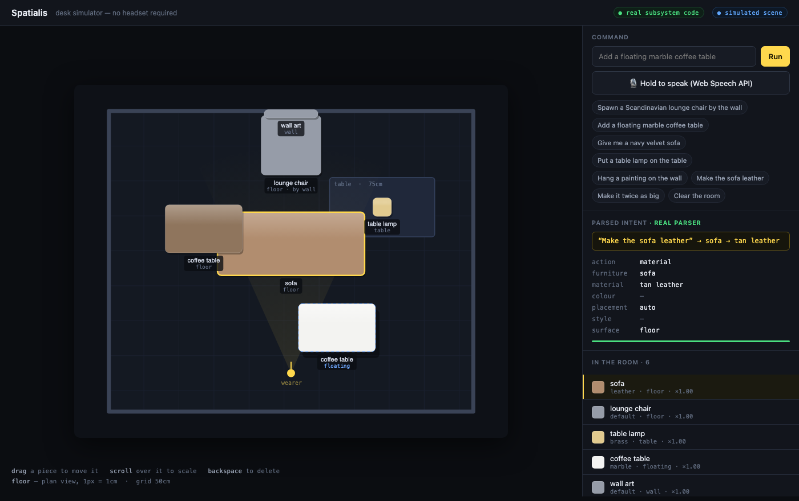

# 👓 Spatialis — Voice & Gesture 3D Spatial Interior Design Tool for SPECS

> Built for the **CLAD Summer Hackathon** by **Snap Inc. / SPECS / Lenslist** (Week 4: CREATE)
> **Submission deadline:** September 6, 2026 @ 23:59 PT
> **Coding agent:** Claude Code + CLAD (Closed Loop Agentic Development)
> **Environment:** Lens Studio 5.22+ · Spectacles Project Mode · TypeScript
> **License:** Apache-2.0

[](https://github.com/mrnetwork0001/Spatialis/actions/workflows/ci.yml)
[](LICENSE)
[](Tests/)

---

## 🎬 Demo

> **Video walkthrough:** _(link to be added before submission)_



*The desk simulator, running the real subsystem code in a browser. Every piece
here was placed by a spoken sentence — the chair anchored `floor · by wall`,
the coffee table `floating`, the lamp on a physical tabletop.*

---

## 📌 Overview

Spatialis lets you redecorate the room you are standing in. You speak, and
furniture appears on your actual floor. You pinch, and you move it. You speak
again, and it changes material.

Stand in your room and say *"Spawn a Scandinavian lounge chair by the wall"* —
Spatialis parses the intent, finds the wall, finds the floor in front of it,
and stands a chair there facing into the room.

---

## 🏗️ The four subsystems

| # | Subsystem | File | Responsibility |
|---|---|---|---|
| 1 | **Voice Intent Engine** | [`Scripts/VoiceCommandController.ts`](Scripts/VoiceCommandController.ts) | VoiceML transcription → parsed intent → prefab instantiation with a scale-in animation |
| 2 | **Hand Gesture Controller** | [`Scripts/SpatialGestureController.ts`](Scripts/SpatialGestureController.ts) | SPECS hand tracking: pinch, drag, two-hand rotate and scale |
| 3 | **Surface Anchor Engine** | [`Scripts/SurfaceAnchorEngine.ts`](Scripts/SurfaceAnchorEngine.ts) | World Query hit testing; classifies floor / table / wall / ceiling and snaps to it |
| 4 | **PBR Material Swapper** | [`Scripts/PBRMaterialSwapper.ts`](Scripts/PBRMaterialSwapper.ts) | 11 finishes and 10 tints, cross-faded onto per-object material clones |

All four communicate through [`Scripts/SpatialisCore.ts`](Scripts/SpatialisCore.ts) —
a shared vocabulary, a registry of everything placed in the room, and the math
helpers — so no subsystem holds a direct reference to another.

---

## 🎙️ What you can say

```
Spawn a Scandinavian lounge chair by the wall
Add a floating marble coffee table
Give me a navy velvet sofa
Hang a painting on the wall
Put a table lamp on the table

Make the sofa velvet          Make the chairs navy
Turn the coffee table into carrara marble

Make it a bit bigger          Make it twice as big
Remove the lamp               Undo
Clear the room
```

The parser fills slots rather than matching a grammar, so it survives real
speech: *"uh put a like dark wood coffee table over there"* resolves to a
walnut coffee table. It also distinguishes **"by the wall"** (a floor piece
backed up to a wall) from **"on the wall"** (a wall mount) — the same noun,
two different placements.

---

## ✋ What you can do with your hands

| Gesture | Result |
|---|---|
| Pinch near a piece | Grab it |
| Move a pinched hand | Drag it through the room |
| Pinch with both hands | Scale by hand separation, rotate by the yaw between them |
| Release | Hand back to the anchor engine, which settles it onto the surface below |

Pinch detection uses **hysteresis** — it closes at 3.0cm and opens at 4.5cm.
At arm's length, tracked joints jitter by millimetres, and a single threshold
makes furniture flicker between grabbed and dropped.

---

## 🖥️ Try it without a headset

Spatialis ships a **desk simulator** that runs the real subsystem code in a
browser — the actual parser, catalog, object registry, material presets and
surface classification, imported from the same `Scripts/*.ts` the Lens uses.

```bash
npm install
npm run sim          # builds the web bundle and serves on :8777
```

Then open **http://localhost:8777/** — the landing page, with a **Launch app** button.

Type commands, click the examples, or use the mic (Web Speech API — and like
the Lens, it shows interim text but only acts on the final transcript). Drag a
piece to move it, scroll over it to scale, backspace to delete. Releasing a
drag re-classifies the surface underneath, exactly as `reseat()` does on device.

A scene can be shared as a link:
`?cmd=Give me a navy velvet sofa|Make it twice as big`

What is **real**: the parser, `FURNITURE_CATALOG`, `SpatialisRegistry`, the
material presets, `classify()`.
What is **simulated**: the room, hit tests, rendering, and mouse-as-pinch. On
device, World Query and SIK hand tracking replace those.

---

## 🚀 Quickstart

```bash
git clone https://github.com/mrnetwork0001/Spatialis.git
cd Spatialis
npm install

npm run typecheck   # strict type check of all four subsystems
npm test            # 68 behavioural tests across all four subsystems
npm run sim         # landing page + app on http://localhost:8777/
```

The suite covers what cannot be verified by looking through a headset:

| Suite | Cases | Covers |
|---|---|---|
| `core.test.js` | 17 | Alias resolution, registry, framerate-independent damping |
| `voice-parser.test.js` | 26 | The demo script plus the phrasings likely spoken instead |
| `anchor.test.js` | 9 | Floor / table / wall / ceiling classification and its bounds |
| `gesture.test.js` | 16 | Pinch hysteresis, grab reach, two-hand scale, release transitions |

Both run on any machine — **no Lens Studio and no headset required**. The
project ships local ambient type stubs ([`types/lens-studio.d.ts`](types/lens-studio.d.ts))
and a Node stand-in for the Lens Studio runtime ([`Tests/lens-runtime-stub.js`](Tests/lens-runtime-stub.js))
so the logic can be verified in CI.

To run it on Spectacles, follow **[SETUP_LENS_STUDIO.md](SETUP_LENS_STUDIO.md)** —
project modules, scene hierarchy, Inspector wiring, prefab requirements and
on-device tuning.

---

## 📁 Repository layout

```
Scripts/
  SpatialisCore.ts             shared vocabulary, object registry, math + tweens
  VoiceCommandController.ts    Subsystem 1 — Voice Intent Engine
  SpatialGestureController.ts  Subsystem 2 — Hand Gesture Controller
  SurfaceAnchorEngine.ts       Subsystem 3 — Surface Anchor Engine
  PBRMaterialSwapper.ts        Subsystem 4 — PBR Material Swapper
Simulator/                     browser desk simulator (real code, simulated room)
types/lens-studio.d.ts         local Lens Studio API stubs (CI type-checking only)
Tests/                         68 behavioural tests + Lens runtime and SIK stubs
Tools/patch-build.js           makes tsc output loadable under Node and browsers
.github/workflows/ci.yml       typecheck + test + simulator build on every push
SETUP_LENS_STUDIO.md           scene wiring and on-device tuning
SPATIALIS_PROJECT_SPEC.md      master specification
CLAD_PROMPT_LOG.txt            full CLAD agent transcript
```

---

## 📊 Status

| | |
|---|---|
| Four subsystems implemented | ✅ type-checked under `strict` |
| Behavioural test suite | ✅ 68 passing |
| Desk simulator | ✅ runs from a clone, no headset |
| Lens Studio scene wiring | ⬜ needs prefabs — see [SETUP_LENS_STUDIO.md](SETUP_LENS_STUDIO.md) |
| On-device pass on Spectacles | ⬜ pinch distances are reasoned defaults, not yet tuned on a hand |
| Demo video | ⬜ |

Pinch thresholds, grab radius and drag smoothing have **not** been validated on
real hardware. They are documented, adjustable in the Inspector, and covered by
tests for their logic — but the feel is untested.

---

## 📄 License

Apache-2.0 — see [LICENSE](LICENSE).
